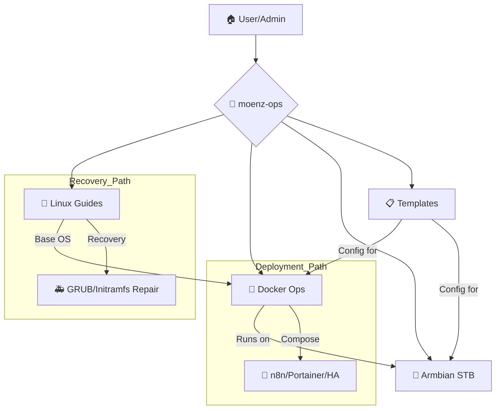

# 🛠️ moenz-ops

**Personal Linux Operations Knowledge Base**
*Knowledge base pribadi berisi dokumentasi troubleshooting, recovery guide, konfigurasi sistem, dan catatan sysadmin untuk kebutuhan operasional sehari-hari.*

---

## 🎯 Tujuan Repository
Repository ini berfungsi sebagai pusat dokumentasi teknis untuk memastikan efisiensi dalam pemeliharaan sistem dan mempercepat proses recovery saat terjadi kegagalan sistem.

- 📒 **Personal Sysadmin Notebook**: Catatan konfigurasi harian.
- 🛠️ **Troubleshooting Archive**: Dokumentasi solusi atas masalah yang pernah terjadi.
- 🚑 **Recovery Documentation**: Panduan langkah-demi-langkah untuk disaster mitigation.
- ⚙️ **System Configuration Reference**: Referensi standar konfigurasi sistem.

---

## 📉 Operational Flow Diagram

---

## 🗺️ Navigasi Repository

| Folder       | Deskripsi                                    | Konten Utama                                    |
| :---         | :---                                         | :---                                            |
| [`armbian/`](./armbian/)   | Dokumentasi infrastruktur STB & Armbian          | Setup Docker, n8n, dan Troubleshooting STB        |
| [`docker/`](./docker/)     | Pusat konfigurasi container                      | Docker Compose files & setup Portainer            |
| [`linux/`](./linux/)       | Panduan umum sistem operasi Linux               | GRUB repair, initramfs recovery, & setup awal    |
| [`templates/`](./templates/) | Boilerplate & standar konfigurasi              | Template ESPHome & Home Assistant automation     |
| [`scripts/`](./scripts/)   | Otomatisasi & utilitas pembantu                | Backup, Sync, & Maintenance scripts              |

---

## 📏 Standar Dokumentasi

Untuk menjaga konsistensi, setiap dokumen baru diusahakan mengikuti standar berikut:

**1. Struktur Konten:**
- **Summary**: Ringkasan masalah/tujuan.
- **Environment**: Detail OS/Hardware yang digunakan.
- **Step-by-step Guide**: Langkah eksekusi yang jelas.
- **Verification**: Cara memastikan solusi berhasil.
- **Post-mortem**: Analisis penyebab masalah.
- **Prevention**: Langkah pencegahan agar masalah tidak terulang.

**2. Naming Convention:**
- **Markdown Files**: `verb-topic.md` (Contoh: `recover-initramfs-grub.md`)
- **Scripts**: `verb-purpose.sh` (Contoh: `backup-home.sh`)

---

## 🚀 Quick Start Guide

Jika Anda mencari solusi cepat, silakan cek:
- **Gagal Boot/Masuk BusyBox?** -> Lihat [`linux/guides/recover-initramfs-grub.md`](./linux/guides/recover-initramfs-grub.md)
- **Setup Container Baru?** -> Lihat [`docker/README.md`](./docker/README.md)
- **Konfigurasi Armbian?** -> Lihat [`armbian/README.md`](./armbian/README.md)

---

## 🔮 Future Plans
- [ ] Otomatisasi skrip backup & restore.
- [ ] Dokumentasi infrastruktur dalam bentuk diagram (Mermaid/Draw.io).
- [ ] Networking guides & server management.

---

**Note:** *Semua dokumentasi ditulis berdasarkan pengalaman penggunaan nyata dan dapat berubah sesuai kebutuhan environment.*
